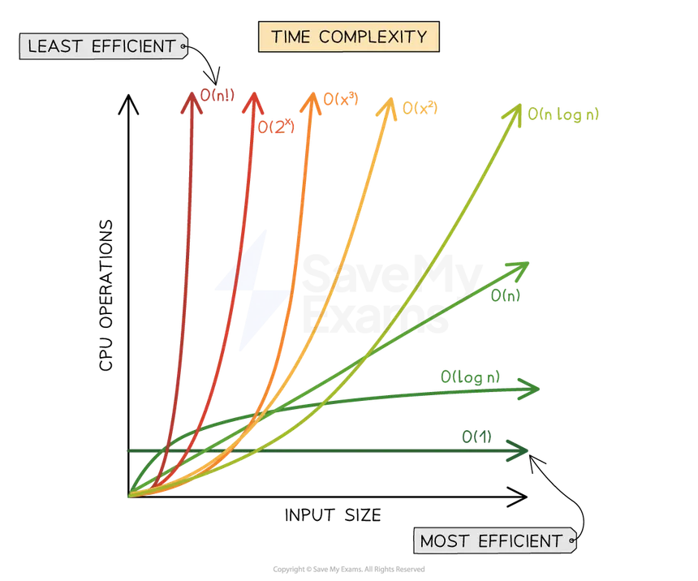

# Big O Notation Guide

## Table of Contents
- [What is Big O Notation?](#what-is-big-o-notation)
- [Why Should You Care?](#why-should-you-care)
- [Common Time Complexities](#common-time-complexities)
- [Visual Comparison](#visual-comparison)
- [Detailed Explanations](#detailed-explanations)
- [Space Complexity](#space-complexity)
- [How to Calculate Big O](#how-to-calculate-big-o)
- [Common Patterns in Code](#common-patterns-in-code)
- [Best, Average, and Worst Case](#best-average-and-worst-case)
- [Practical Tips](#practical-tips)

---

## What is Big O Notation?

Big O Notation is a way to describe **how fast an algorithm runs** or **how much memory it uses** as the input size grows. It answers the question: *"If I double my input, what happens to the runtime?"*

Think of it like fuel efficiency for cars:
- **O(1)** = Electric car - constant "fuel" usage no matter the distance
- **O(n)** = Regular car - fuel usage grows linearly with distance
- **O(n²)** = Gas guzzler - fuel usage grows exponentially with distance

### Key Points
- Big O describes the **worst-case scenario**
- It focuses on **growth rate**, not exact time
- We drop constants and lower-order terms
  - `O(2n)` → `O(n)`
  - `O(n² + n)` → `O(n²)`

---

## Why Should You Care?

### Real-World Impact

| Array Size | O(1) | O(log n) | O(n)     | O(n log n) | O(n²)             | O(2ⁿ)     |
|------------|------|----------|----------|------------|-------------------|-----------|
| 10         | 1    | 3        | 10       | 33         | 100               | 1,024     |
| 100        | 1    | 7        | 100      | 664        | 10,000            | 1.27×10³⁰ |
| 1,000      | 1    | 10       | 1,000    | 9,966      | 1,000,000         |     ∞     |
| 1,000,000  | 1    | 20       | 1,000,000| 19,931,569 | 1,000,000,000,000 |     ∞     |

**Example:** Searching for a name in a phone book
- **O(n)** - Linear Search: Check every name (could take minutes)
- **O(log n)** - Binary Search: Open middle, eliminate half (takes seconds)

---

## Common Time Complexities

From **fastest** to **slowest**:

O(1) < O(log n) < O(n) < O(n log n) < O(n²) < O(2ⁿ) < O(n!)
↑                                                        ↑
Fast                                                   Slow

### Quick Reference Table

| Notation | Name | Example Operation | When Input Doubles |
|----------|------|-------------------|-------------------|
| O(1) | Constant | Access array element | Time stays same |
| O(log n) | Logarithmic | Binary search | Time increases slightly |
| O(n) | Linear | Loop through array | Time doubles |
| O(n log n) | Linearithmic | Merge sort, Quick sort | Time slightly more than doubles |
| O(n²) | Quadratic | Nested loops | Time quadruples |
| O(2ⁿ) | Exponential | Recursive fibonacci | Time squares |
| O(n!) | Factorial | Generate all permutations | Time explodes |

---

## Visual Comparison

## Detailed Explanations

### O(1) - Constant Time

**Definition:** Algorithm takes the same time regardless of input size.

**Real-world analogy:** Getting a book from a specific shelf. Whether the library has 100 or 1,000,000 books, if you know the shelf number, it takes the same time.

**When to use:**
- Direct access to data (arrays, hash maps)
- Mathematical formulas
- Returning cached results

### O(log n) - Logarithmic Time

**Definition:** Algorithm cuts the problem in half each step.

**Real-world analogy:** Finding a word in a dictionary. You open to the middle, see if your word comes before or after, then only search that half. Repeat.

**When to use:**
- Searching in sorted data
- Divide and conquer algorithms
- Tree operations (balanced trees)

**Key insight:** Extremely efficient for large datasets!

---

### O(n) - Linear Time

**Definition:** Algorithm processes each element once.

**Real-world analogy:** Reading a book. If it has 100 pages, it takes 100 units of time. If 200 pages, takes 200 units.

**When to use:**
- Need to check every element
- Linear search
- Simple array/list operations

### O(n log n) - Linearithmic Time

**Definition:** Algorithm performs O(log n) work for each of n elements.

**Real-world analogy:** Organizing a deck of cards using merge sort. You split the deck (log n times), then merge everything back together (n work per level).

**When to use:**
- Efficient sorting (Merge Sort, Quick Sort, Heap Sort)
- Most optimal comparison-based sorting

### O(n²) - Quadratic Time

**Definition:** Nested loops where each loop runs n times.

**Real-world analogy:** Checking every person against every other person for common friends. For 10 people, that's 100 comparisons. For 100 people, that's 10,000!

**When to use:**
- Small datasets only
- When simplicity matters more than efficiency
- Sometimes unavoidable (comparing all pairs)

**Key insight:** Try to avoid if possible! Often can be optimized to O(n) or O(n log n).

### O(n!) - Factorial Time

**Definition:** Number of operations is the factorial of input size.

**Real-world analogy:** Trying every possible seating arrangement for dinner guests. For 3 guests: 6 arrangements. For 10 guests: 3,628,800 arrangements!

**When to use:**
- Traveling Salesman Problem (brute force)
- Generating all permutations
- Almost never in production!

**Key insight:** Only works for very small inputs (n < 10).